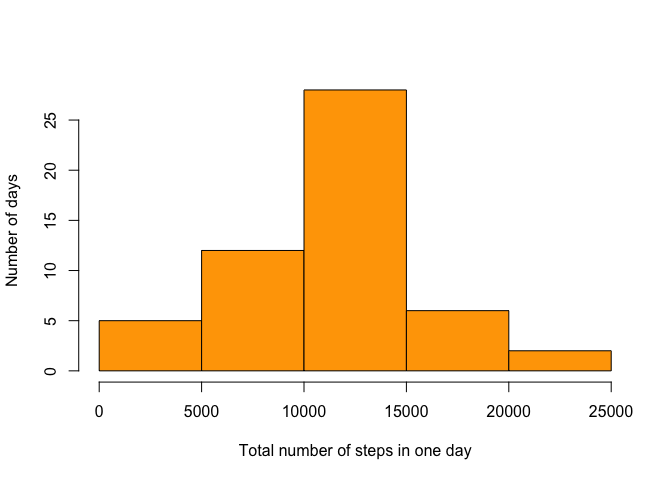
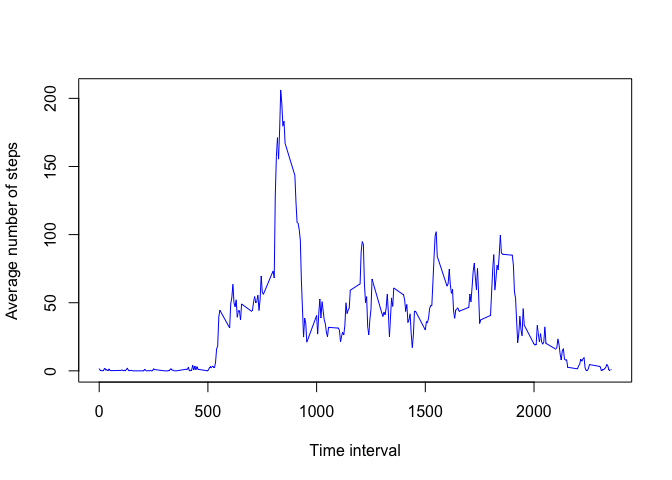
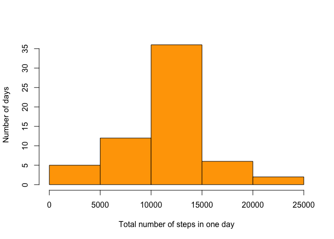
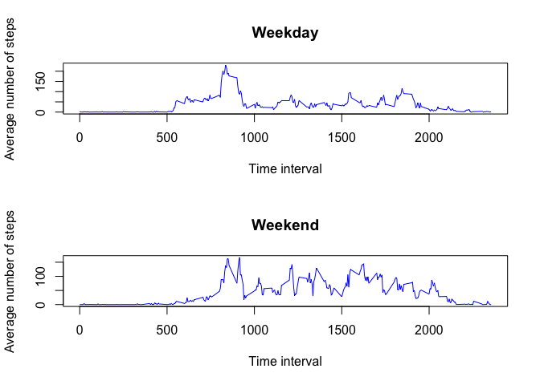

# Reproducible Research: Peer Assessment 1


## Loading and preprocessing the data

1. Set the working directory


```r
setwd("/Users/shengnanhuang/Documents/data/RepData_PeerAssessment1/")
```

2. Read the data, and store it in the data frame variable a

```r
a<-read.csv(unz("./activity.zip","activity.csv"))
head(a)
```

```
##   steps       date interval
## 1    NA 2012-10-01        0
## 2    NA 2012-10-01        5
## 3    NA 2012-10-01       10
## 4    NA 2012-10-01       15
## 5    NA 2012-10-01       20
## 6    NA 2012-10-01       25
```


## What is mean total number of steps taken per day? (Ignore the missing values in the dataset.)

### Calculate the total number of steps taken per day

1. Subset the data frame a by ignoring the missing values, and store the data in b

```r
b<-a[!is.na(a$steps),]
head(b)
```

```
##     steps       date interval
## 289     0 2012-10-02        0
## 290     0 2012-10-02        5
## 291     0 2012-10-02       10
## 292     0 2012-10-02       15
## 293     0 2012-10-02       20
## 294     0 2012-10-02       25
```

2. Calculate the total number of steps taken per day, and store the data in c


```r
c<-tapply(b$steps,as.character(b$date),sum)
c
```

```
## 2012-10-02 2012-10-03 2012-10-04 2012-10-05 2012-10-06 2012-10-07 
##        126      11352      12116      13294      15420      11015 
## 2012-10-09 2012-10-10 2012-10-11 2012-10-12 2012-10-13 2012-10-14 
##      12811       9900      10304      17382      12426      15098 
## 2012-10-15 2012-10-16 2012-10-17 2012-10-18 2012-10-19 2012-10-20 
##      10139      15084      13452      10056      11829      10395 
## 2012-10-21 2012-10-22 2012-10-23 2012-10-24 2012-10-25 2012-10-26 
##       8821      13460       8918       8355       2492       6778 
## 2012-10-27 2012-10-28 2012-10-29 2012-10-30 2012-10-31 2012-11-02 
##      10119      11458       5018       9819      15414      10600 
## 2012-11-03 2012-11-05 2012-11-06 2012-11-07 2012-11-08 2012-11-11 
##      10571      10439       8334      12883       3219      12608 
## 2012-11-12 2012-11-13 2012-11-15 2012-11-16 2012-11-17 2012-11-18 
##      10765       7336         41       5441      14339      15110 
## 2012-11-19 2012-11-20 2012-11-21 2012-11-22 2012-11-23 2012-11-24 
##       8841       4472      12787      20427      21194      14478 
## 2012-11-25 2012-11-26 2012-11-27 2012-11-28 2012-11-29 
##      11834      11162      13646      10183       7047
```


### Make a histogram of the total number of steps taken each day

Use base plot system


```r
hist(c,xlab="Total number of steps in one day", ylab="Number of days", main="", col="orange")
```

<!-- -->

### Calculate and report the mean and median of the total number of steps taken per day

1. Calculate the mean


```r
mean(c)
```

```
## [1] 10766.19
```

2. Calculate the median

```r
median(c)
```

```
## [1] 10765
```

## What is the average daily activity pattern?

### Make a time series plot of the 5-minute interval (x-axis) and the average number of steps taken, averaged across all days (y-axis)
1. Calculate the average number of steps taken at every 5-minute interval, and store the data in the vector variable d


```r
d<-tapply(b$steps,b$interval,mean)
```

2, Convert the vector variable into a data frame d2


```r
d2<-data.frame(interval=rep(1,length(d)),steps=rep(1,length(d)))
d2$interval<-names(d)
d2$steps<-d
```

3, Plot d2 using base plot system


```r
plot(d2,type="l", xlab="Time interval", ylab="Average number of steps", col="blue")
```

<!-- -->

### Which 5-minute interval, on average across all the days in the dataset, contains the maximum number of steps?


```r
d2[d2$steps==max(d2$steps),]$interval
```

```
## [1] "835"
```

## Imputing missing values

### Calculate and report the total number of missing values in the dataset 

```r
sum(is.na(a$steps))
```

```
## [1] 2304
```

### Devise a strategy for filling in all of the missing values in the dataset

Fill in the missing value by the mean for that 5-minute interval


```r
for (i in 1:length(d2$interval)){
  a[is.na(a$steps)&a$interval==d2$interval[i],]$steps<-d2$steps[i]
}
head(a)
```

```
##       steps       date interval
## 1 1.7169811 2012-10-01        0
## 2 0.3396226 2012-10-01        5
## 3 0.1320755 2012-10-01       10
## 4 0.1509434 2012-10-01       15
## 5 0.0754717 2012-10-01       20
## 6 2.0943396 2012-10-01       25
```

### Make a histogram of the total number of steps taken each day and Calculate and report the mean and median total number of steps taken per day

1. Make a histogram of the total number of steps taken each day


```r
e<-tapply(a$steps,as.character(a$date),sum)
hist(e,xlab="Total number of steps in one day", ylab="Number of days", main="", col="orange")
```

<!-- -->

2. Calculate the mean total number of steps taken per day


```r
mean(e)
```

```
## [1] 10766.19
```

3. Calculate the median total number of steps taken per day


```r
median(e)
```

```
## [1] 10766.19
```

We can see the mean total number is the same as the one calculated before, but the median total number is slightly different. That means that the method we used does not change the mean but changes the median a little bit.


## Are there differences in activity patterns between weekdays and weekends?

### Create a new factor variable in the dataset with two levels – “weekday” and “weekend” indicating whether a given date is a weekday or weekend day

Use dyplr package, and add another column to the data frame a


```r
library(dplyr)
```

```
## 
## Attaching package: 'dplyr'
```

```
## The following objects are masked from 'package:stats':
## 
##     filter, lag
```

```
## The following objects are masked from 'package:base':
## 
##     intersect, setdiff, setequal, union
```

```r
aa<-mutate(a,w=ifelse(weekdays(as.Date(date))=="Saturday"|weekdays(as.Date(date))=="Sunday","weekend","weekday"))
```

### Make a panel plot containing a time series plot of the 5-minute interval (x-axis) and the average number of steps taken, averaged across all weekday days or weekend days (y-axis)

1. Calculate the average number of steps taken at every 5-minute interval, averaged across all weekday days or weekend days 

```r
aa1<-tapply(aa[aa$w=="weekday",]$steps,aa[aa$w=="weekday",]$interval,mean)
aa2<-tapply(aa[aa$w=="weekend",]$steps,aa[aa$w=="weekend",]$interval,mean)
```

2. Convert the vector variables aa1 and aa2 to data frame variables aa3 and aa4


```r
aa3<-data.frame(interval=rep(1,length(aa1)),steps=rep(1,length(aa1)))
aa3$interval<-names(aa1)
aa3$steps<-aa1

aa4<-data.frame(interval=rep(1,length(aa2)),steps=rep(1,length(aa2)))
aa4$interval<-names(aa2)
aa4$steps<-aa2
```

3. Plot aa3 and aa4 using base plot system

```r
par(mfrow=c(2,1))
plot(aa3,type="l", xlab="Time interval", ylab="Average number of steps", main="Weekday", col="blue")
plot(aa4,type="l", xlab="Time interval", ylab="Average number of steps", main="Weekend",col="blue")
```

<!-- -->
